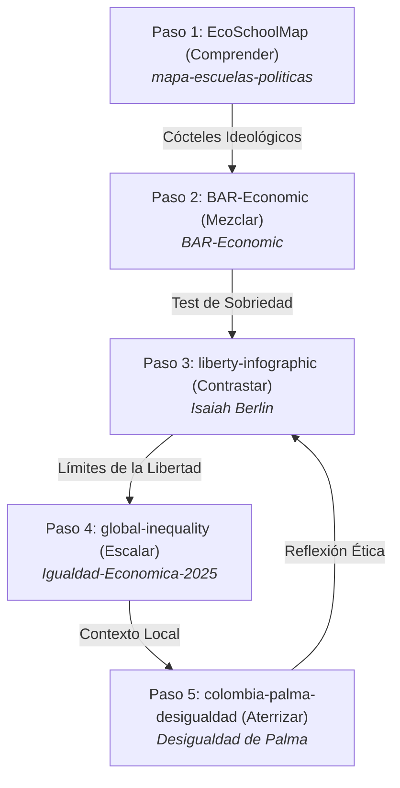

# 🍪 La Galleta Colombiana · Paso 5

### *Visualización interactiva y análisis crítico sobre la concentración de ingresos en Colombia a través del Coeficiente de Palma (2002–2023).*
### *An interactive visualization and critical analysis of income concentration in Colombia through the Palma Ratio (2002–2023).*

---

[](https://willkwolf.github.io/colombia-palma-desigualdad/)
[](https://github.com/willkwolf/colombia-palma-desigualdad)
[](https://creativecommons.org/licenses/by/4.0/)
[](https://github.com/willkwolf/colombia-palma-desigualdad)

---

## 🌐 Demo en Vivo / Live Demo
**👉 [Ver en vivo en GitHub Pages](https://willkwolf.github.io/colombia-palma-desigualdad/)**

---

## 🧭 La Ruta del Pensamiento Crítico (El Ecosistema)
Este proyecto forma parte de **"La Ruta del Pensamiento Crítico"**, una red interactiva de 5 webs estáticas de `@willkwolf` que conectan teoría económica, dilemas políticos, brechas materiales y contextos locales.



> [!NOTE]
> **Estás en el Paso 5: Aterrizar**. En el paso anterior visualizaste la escala de la brecha mundial. Aquí aterrizas ese análisis global a la realidad local de Colombia mediante el Coeficiente de Palma. En la sección final, la tensión social provocada por la extrema desigualdad te invitará a cuestionar éticamente los conceptos y límites de la libertad, **retornando al Paso 3: Filosofía de la Libertad** para cerrar el bucle reflexivo de la ruta.

---

## 🔍 Contexto Temático / Philosophical Context

El economista chileno **Gabriel Palma** (Universidad de Cambridge) describió un fenómeno global persistente: en casi cualquier sociedad, la clase media (el 50% de la población entre los deciles 5 y 9) captura de forma sumamente estable **entre el 45% y el 55%** del ingreso nacional disponible. Es el "ruido estable" del sistema de distribución.

La desigualdad no se define en el centro, sino en las colas de la pirámide: la disputa se centra en cuántas "galletas" se apropia el extremo superior en comparación con la base. El **Coeficiente de Palma** mide directamente esta relación de poder distributivo:

$$\text{Coeficiente de Palma} = \frac{\text{Participación en el ingreso del 10\% más rico (Decil 10)}}{\text{Participación en el ingreso del 40\% más pobre (Deciles 1 al 4)}}$$

Un Palma de **1.0** representa que la décima parte más rica de la población gana en conjunto exactamente lo mismo que el 40% más desfavorecido. Mientras que países desarrollados registran coeficientes cercanos a 1.0 o 1.2, **Colombia ha oscilado históricamente entre 3.7 y 5.0** en los últimos 20 años, situándose de forma consistente en la lamentable lista de los países más desiguales del planeta.

---

## 🤓 Para el Lector más Nerd / Ficha Técnica (Deep Tech & Data Insights)

### Contexto de los Datos y Puntos Ciegos
Para interpretar la infografía sin estirar el indicador más allá de sus límites metodológicos, es crucial entender cómo está calculada "la galleta" (el ingreso):
* **Qué SÍ mide:** Mide el **ingreso monetario disponible per cápita del hogar, post-transferencias monetarias públicas**, reportado en la Gran Encuesta Integrada de Hogares (GEIH) del DANE (serie MESEP empalmada). Incluye salarios, pensiones, arriendos imputados y subsidios directos.
* **Puntos Ciegos (Lo que NO mide):**
  * **Riqueza acumulada:** Mide flujo de ingresos anuales, no el stock de riqueza (tierra, bienes inmobiliarios o acciones financieras). La desigualdad de riqueza en Colombia es considerablemente superior (3 a 4 veces mayor, con coeficientes Gini de riqueza que superan el 0.85).
  * **Subreporte del decil 10:** Las encuestas de hogares sufren un severo subreporte de ingresos de capital y dividendos en el 1% y 0.1% más rico. Los multimillonarios reales son invisibles para los encuestadores del DANE, por lo que el Palma real es superior al reportado.
  * **Brechas regionales:** El Palma nacional de **3.7** suaviza realidades rurales brutales. Departamentos como Chocó o La Guajira registran niveles de pobreza y desigualdad monetaria que duplican las capitales principales.

### Decisiones de Arquitectura Monolítica (Archival-Safe)
El proyecto rechaza los frameworks modernos para garantizar **inmunidad absoluta a la obsolescencia tecnológica**:
* **Cero Compilación:** Al no depender de React, Next.js, Vite o npm, el archivo `index.html` es auto-portante (contiene su propio CSS y JavaScript nativo).
* **Durabilidad en el Tiempo:** Puedes descargar y hacer doble clic sobre `index.html` en cualquier computadora y **funcionará exactamente igual en el año 2040** sin romper dependencias locales.

---

## 🛠️ Stack Tecnológico

* **HTML5 Semántico & CSS3 Premium:** Estilo de diseño de museo antiguo e infografía clásica de Tufte con fuentes premium de Google Fonts.
* **Vanilla Javascript:** Lógica reactiva para recalcular dinámicamente el Waffle Chart de galletas y trazar el gráfico de rango-eje SVG.
* **GitHub Actions Pipeline:** Workflow automático que valida en cada push la semántica HTML5, realiza auditorías de accesibilidad WCAG 2.1 AA en consola mediante `@axe-core/cli` y realiza el despliegue automático a producción.

---

## 📦 Instalación y Uso Local

Al no poseer pasos de compilación ni node_modules, la instalación local es trivial:

```bash
# 1. Clonar el repositorio
git clone https://github.com/willkwolf/colombia-palma-desigualdad.git
cd colombia-palma-desigualdad

# 2. Servir o abrir index.html directamente en tu navegador
npx live-server
```

---

## 🔧 Guía de Mantenimiento (Edición y Carga de Datos)

Para actualizar la serie histórica de desigualdad y la simulación interactiva con nuevas encuestas publicadas por el DANE:

### 1. Actualizar el Historial
Busca en `index.html` el array `HISTORICAL_DATA` y añade el nuevo año con su valor y fase:
```javascript
const HISTORICAL_DATA = [
  { year: 2002, value: 4.9, phase: 'crisis' },
  { year: 2004, value: 4.7, phase: 'crisis' },
  // ...
  { year: 2023, value: 3.7, phase: 'recuperacion' }
];
```
*El trazador SVG recalculará de forma automática las proporciones y márgenes de la curva sin Lie Factor.*

### 2. Modificar la Analogía del Waffle Chart
Localiza el objeto de distribución de las 100 galletas y actualiza sus valores (*asegúrate de que sumen exactamente 100*):
```javascript
const PALMA_DISTRIBUTION = {
  poorShare: 12,    // % de galletas para el 40% pobre
  middleShare: 43,  // % de galletas para el 50% medio
  richShare: 45     // % de galletas para el 10% rico
};
```

---

## 📝 Cómo Citar / Citation (APA 7)

**Referencia en formato APA 7ma Edición:**
> Artunduaga Viana, W. C. (2026). *La Galleta Colombiana: Radiografía de la Desigualdad y Análisis Crítico del Coeficiente de Palma en Colombia* [Visualización de datos interactiva]. GitHub. https://github.com/willkwolf/colombia-palma-desigualdad

**BibTeX para referencias bibliográficas:**
```bibtex
@software{artunduaga2026palma,
  author = {Artunduaga Viana, William Camilo},
  title = {La Galleta Colombiana: Radiografía de la Desigualdad},
  year = {2026},
  publisher = {GitHub},
  url = {https://github.com/willkwolf/colombia-palma-desigualdad},
  note = {Visualización crítica interactiva del Coeficiente de Palma en Colombia con micro-datos del DANE}
}
```

---

## 📜 Licencia / License

Este proyecto se publica bajo la licencia **Creative Commons Attribution 4.0 International (CC BY 4.0)**.

[](https://creativecommons.org/licenses/by/4.0/)

**Bajo esta licencia puedes:**
* **Compartir:** Copiar, redistribuir y comunicar libremente el material.
* **Adaptar:** Remezclar, transformar y construir sobre el material para cualquier propósito, incluso comercial.
* **Atribución:** Debes reconocer la autoría de forma correspondiente y proporcionar un enlace a la licencia.
